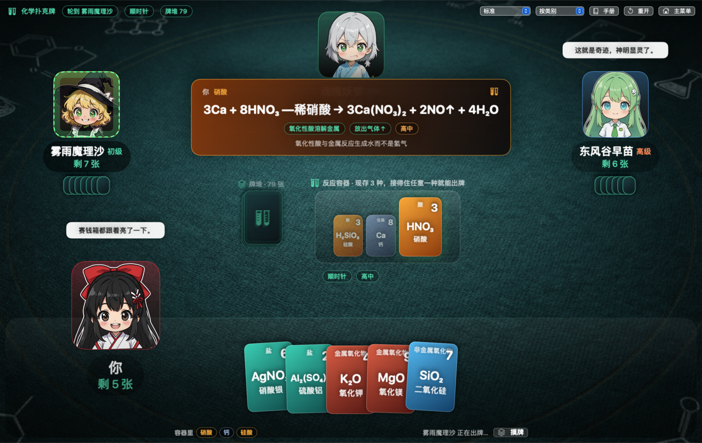
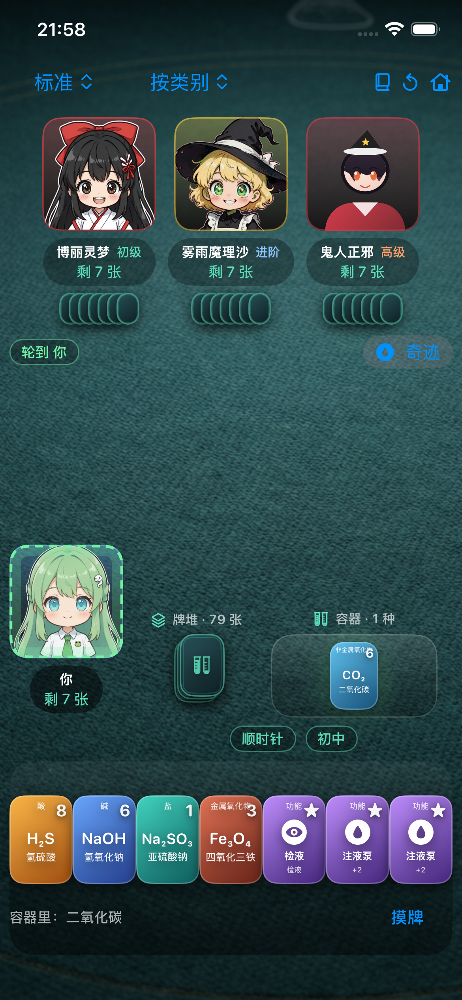
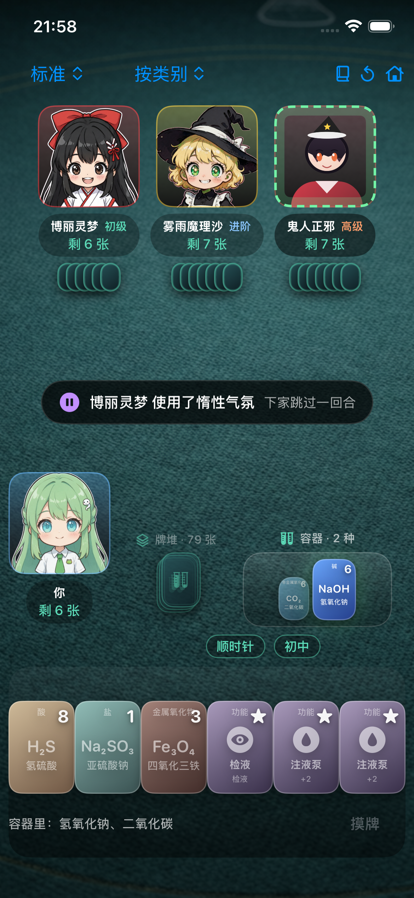

# 化学扑克牌 ChemCards

macOS / iPhone 原生桌游。玩法像 UNO，但**只有能和反应容器（一槽混合物）发生化学反应的牌才打得出去**——裁判不是数值，是一张真实的反应表。

单机 PVE：你 + 3 个 AI（初级 / 进阶 / 高级 / 混合桌）。



---

## 编译与运行

要求：macOS 13+ 、Xcode 14+（含命令行工具）。**零第三方依赖**，SwiftPM 直接构建。

```bash
cd ~/Desktop/ChemCards
bash build.sh              # → dist/ChemCards.app（release 构建 + ad-hoc 签名）
open dist/ChemCards.app

bash run.sh                # 调试用：debug 构建后立刻打开，改完代码一条命令重跑
swift test                 # 自检：化学守恒、非法出牌、AI 自动对局、状态机
```

`build.sh` 做的事：`swift build -c release` → 手搭 `ChemCards.app/Contents/{MacOS,Resources}` → 写 `Info.plist` → 把 `Resources/` 整目录拷进 bundle → `codesign --force --deep -s -` ad-hoc 签名。

> 这里刻意**不用** SwiftPM 的 `Bundle.module`：SwiftPM 把资源放在二进制旁边的 `.module-resources` 里，手搭的 `.app` 解析不到，所以资源一律走 `Bundle.main.resourceURL`。

如果从浏览器/网盘拿到的 app 被 Gatekeeper 拦（`open` 提示无法验证），清掉隔离属性即可：

```bash
xattr -cr dist/ChemCards.app
```

## iPhone（竖屏）

同一套 `Sources/ChemCards` 编译成 iOS 应用，界面按平台分叉：`SceneLayout.isPhone` 为真时用 `PhoneTableView`，六条横向分带替掉桌面那张按横屏比例摆位的牌桌。工程文件由脚本生成，不用手维护：

```bash
bash ios.sh                 # 生成工程 → 模拟器编译 → 装机 → 启动 → 截图 docs/preview-ios.png
bash ios.sh shots           # 六个场景各截一张（menu rules table banner log result）
DEVICE='iPhone SE (3rd generation)' TAG=-se3 bash ios.sh shots   # 换一台机器再截一套
```

竖屏没有菜单栏，手册 / 重开 / 主菜单做成工具条上的图标；出牌改成**两段式**：点一张牌，下面那条会写明它接不接得上、为什么，再按「出牌」确认——叠牌时相邻两张只差 20pt，点即出会打错而且收不回来。

 

### 装到自己手机上

这台机器上没有签名身份，`ios.sh` 只走模拟器。真机要作者自己在 Xcode 里做一次：

```bash
bash ios.sh phone           # 缺什么直接说：证书、Team ID
```

1. Xcode → Settings → Accounts 登录 Apple ID，`ios.sh phone` 报缺证书就顺手在 Manage Certificates 里加一张。
2. 打开 `ios/ChemCardsiOS.xcodeproj`，选中 ChemCards target → Signing & Capabilities → Team 选自己的 Apple ID。Team ID 会写进 `ios/signing.xcconfig`——生成器每次重写 `project.pbxproj`，唯独不动这个文件，所以选好的 Team 不会被下一次重新生成抹掉。
3. 手机插上线、点「信任这台电脑」，scheme 选这台 iPhone，⌘R。

免费 Apple ID 签出来的包 **7 天过期**，图标点开会闪退；重跑一次 ⌘R 就续上。付费开发者账号是一年。

## 玩法

1. 每人起手 7 张，轮流出牌。
2. **容器是一槽混合物**：最近倒进去的 **3 种**物质都还活着，打出的牌只要能跟其中**任意一种**反应就合法。引擎判定合法才允许点击，**平时不给提示**——不发光、不灰显，接不接得上得自己算。
3. 你打出的牌倒进容器，成为新的第 4 种——最早那一种同时沉底、不再参与反应。下家必须接得住这槽混合物。
4. 接不上就摸牌：轮到自己时随时可以主动摸一张，摸完这一手就结束了。
5. 牌堆空了会把容器里用掉的旧牌回收重洗；连旧牌都不剩、手里又一张都接不上时，这一手**过牌**。
6. 手牌只剩 1 张时必须喊「**反应!**」（空格），忘了罚摸 1 张。
7. **先出完手牌的人立刻获胜**，其余按手里剩几张排名。没有分数，没有连锁，方程式本身就是唯一的评价。

窗口宽度是 `MatchRules.vesselWindow`（默认 3）。这个设计是防死锁的正解：一局里「有牌可出」的比例足够高，才不需要「物理混合」那种不算反应的后门。收窄试过两档，都回退了：1 槽三档中位 573~575 手、40 局只有 5~13 局有人出完（45% 的回合完全接不住）；2 槽进阶/高级收束到 45~47 手，但初级桌仍拖到 213 手、8/40 局卡壳。要再收窄，得先把反应表加厚——现在每种物质的伙伴牌中位 18/88，约 17% 命中率，UNO 是 85%。

接不上不是死路：**点一张牌**，界面会写明它接不接得上、以及「和容器里的物质为什么不反应」——这是给初学者的电子手册，牌桌右侧的「手册」里还有全套规则。

功能牌（注液泵 / 惰性气氛 / 可逆反应 / 检液）任何时候都能打，且不改变容器里的物质。

### 角色技能

选的角色决定这一手翻盘牌，**每局限用一次，只有你（人类）能用，AI 不用技能**。桌面键 `S`，按钮上带效果说明。

| 角色 | 技能 | 效果 |
|---|---|---|
| 东风谷早苗 | 引发奇迹 | ≡ 注液泵：下家摸 2 张并跳过 |
| 博丽灵梦 | 梦想封印 | ≡ 惰性气氛：下家跳过一回合 |
| 鬼人正邪 | 鬼之反转 | ≡ 可逆反应：出牌方向反向 |
| 雾雨魔理沙 | 魔炮 | 把牌堆最上面那张物质牌轰进容器，窗口里最早那种被挤出去 |
| 十六夜咲夜 | The World | 这一回合出两张牌 |
| 琪露诺 | 完美冻结 | 把自己冻住，下次轮到自己时跳过 |
| 八意永琳 | 万解诊断 | 本回合标出接得住的牌——**这是全游戏唯一的高亮来源** |

前三个不是三套代码：技能与那张功能牌走同一条结算路径（`GameState.applyAction`），等价关系由 `CharacterSkillTests` 里「与功能牌逐项对比」的断言锁住。「魔炮」只搬牌不造牌，牌堆总数守恒；牌堆和弃牌堆都榨不出物质牌时按钮不亮，也不会白扣一次。

### 牌池（108 张）

| 类别 | 种类 | 例子 |
|---|---|---|
| 酸 | 9 | HCl、H₂SO₄(稀/浓)、HNO₃、H₂CO₃、H₂S、H₂SiO₃、乙酸 |
| 碱 | 10 | NaOH、Ba(OH)₂、NH₃·H₂O、Al(OH)₃、Fe(OH)₃、Cu(OH)₂ |
| 盐 | 23 | AgNO₃、BaCl₂、CuSO₄、Na₂CO₃、NaHCO₃、Al₂(SO₄)₃、KI |
| 金属 | 10 | K、Ca、Na、Mg、Al、Zn、Fe、Cu、Hg、Ag |
| 非金属 | 6 | O₂、H₂、C、S、P、Cl₂ |
| 金属氧化物 | 8 | Na₂O、CaO、CuO、Fe₂O₃、MgO、Al₂O₃ |
| 非金属氧化物 | 7 | CO₂、SO₂、SO₃、SiO₂、P₂O₅、CO、H₂O |
| 有机物 | 3 | 乙醇、苯酚、甲烷 |
| 功能牌 | 20 张 | 注液泵（下家摸 2 并跳过）、惰性气氛（跳过）、可逆反应（反向）、检液（偷看牌堆顶） |

76 种物种 × 多份 = 88 张化学牌 + 20 张功能牌 = 108 张。牌面右上角的 0–9 是「反应活性刻度」，承担 UNO 数字环的配色与排序作用（手牌可以按活性理牌）。

## 裁判：一张静态反应表

`Resources/Data/reactions.json` 有 **516 条**已配平反应，键是无序物种对，值是完整方程式 + 现象 + 知识层（初中/高中）+ 易错点。查表 O(1)，出牌合法性完全由它决定。表里的 `points` 只是给 AI 比较「哪一发反应更值钱」的权重，玩家界面上不出现任何分数。

这张表由规则引擎在开发期推导生成，规则代码在 `Sources/ChemCards/Chemistry/`：

```bash
.build/release/ChemCards --dump-reactions Resources/Data/reactions.json
```

加了新物种或改了规则，跑一次这条命令就能重算全表。`CuratedReactions.swift` 里的显式方程式（有机、浓硫酸/硝酸、铝热等无法由化合价自动推导的）**优先于**规则推导。

改表也可以直接改 JSON：外部目录 `~/Library/Application Support/ChemCards/data/reactions.json` 优先于 bundle 内的同名文件，改完重启游戏生效。

## 换素材

立绘和牌桌背景都走 `AssetLoader` 两级查找：**外部覆盖目录优先于 app bundle**，换图不需要重新编译。

```bash
mkdir -p ~/Library/Application\ Support/ChemCards/assets/Characters/reimu
cp 你的图.png ~/Library/Application\ Support/ChemCards/assets/Characters/reimu/base.png
```

角色目录名：`sanae`（东风谷早苗）、`reimu`（博丽灵梦）、`marisa`（雾雨魔理沙）、`seiga`（鬼人正邪）、`sakuya`（十六夜咲夜）、`cirno`（琪露诺）、`eirin`（八意永琳）。牌桌背景放 `assets/Table/table_bg.png`。新角色一张 `base.png` 就能上，缺的图层会自动退化成程序化脸。

### 分层立绘（伪 Live2D）

没有接 Live2D SDK（`.moc3` 必须由 Cubism Editor 手工产出，无法代码生成）。动画是**分层立绘 + 参数驱动**：每个座位各自一条 24fps 的叶子 `TimelineView`，每帧只有立绘那一子树重算（时钟绝不挂在 `GameState`/`StageDirector` 上，否则整张牌桌跟着每帧重建，Intel Mac 上会明显掉帧）。呼吸用 sin、眨眼定时随机、鼠标视差给头部偏移、发丝袖摆按相位差摆动、说话切 mouth 帧、出牌/被压/摸牌/胜利各有情绪关键帧。开启系统的「减弱动态效果」后全部静止。

图层文件名（全部可选，**缺哪个就降级**，只有 `base.png` 也能跑，只是没有眨眼和口型）：

```
base.png  hair_front.png  sleeve_l.png  sleeve_r.png
eyes_open.png  eyes_close.png  mouth_0.png … mouth_3.png  blush.png
```

仓库里带的立绘是**当前七个角色各一张** `base.png`（`youmu` 已下阵，图留在仓库里没有引用）。这些是纯色背景原创立绘，用脚本一键抠底裁成正方形；不带角色名就处理全部，带上就只重做指定的那几个，免得覆盖已经收下的图：

```bash
python3 Tools/cut_portraits.py <原图目录>                    # 全部七个
python3 Tools/cut_portraits.py <原图目录> seiga eirin        # 只重做这两个
python3 Tools/make_icon.py                    # 重画 macOS App 图标 → build/AppIcon.icns
python3 Tools/make-ios-icon.py sanae          # 换 iOS 图标 → ios/Assets.xcassets/AppIcon.appiconset/
```

iOS 那 1024 图是提交进仓库的，编译时由 actool 编译成 `Assets.car`，平时不用重跑；只有换主角头像时才跑一次上面第三条。

立绘是东方 Project 角色的**原创同人风**图片，不含任何官方素材。

## 自检命令

```bash
./dist/ChemCards.app/Contents/MacOS/ChemCards --smoke-test          # 打印窗口/资源加载状态后退出
./dist/ChemCards.app/Contents/MacOS/ChemCards --render out.png table # 无窗口渲染 UI（menu/table/cards/banner/log/result）
bash ios.sh smoke                                                    # 同一行状态，在 iPhone 模拟器里跑
```

`--render` 是给没有录屏权限的环境准备的照片化自检，改布局时用它比对截图最快。iOS 那侧 `simctl launch --stdout=` 在这版 Xcode 上不落文件，所以 `ios.sh smoke` 走的是 `--console`。

## 键盘操作

| 键 | 作用 |
|---|---|
| 空格 | 喊「反应!」 |
| D | 摸牌 |
| Cmd + L | 反应手册 / 对局实录 |
| Cmd + R | 重开一局 |
| Cmd + N | 新对局 |
| Cmd + . | 结束当前对局 |
| Cmd + Q | 退出 |

## AI

三档都只读 `AIView`——这个类型上**根本不存在**「对手手牌」字段，只有数量和公开的弃牌堆，`AITests` 用反射把这条约束钉死。目标也统一成「尽快把手牌出完」，不追分。

- **初级**：合法牌里随机挑一张，约 12% 概率保守摸牌，功能牌乱用。
- **进阶**：贪心取即时价值最高的一张（反应表权重），会留功能牌。
- **高级**：一层前瞻——模拟新顶牌，用集合运算算「自己下回合接得上的概率」减「三家对手压得住的概率」，再看能不能一击出完、要不要按住快要走完的对手。

`swift test` 里 `AITests` 会跑三档各 500 局自动对局，断言零非法决策、过牌只在真的无事可做时出现、每局都在回合上限内收束、牌数守恒。
